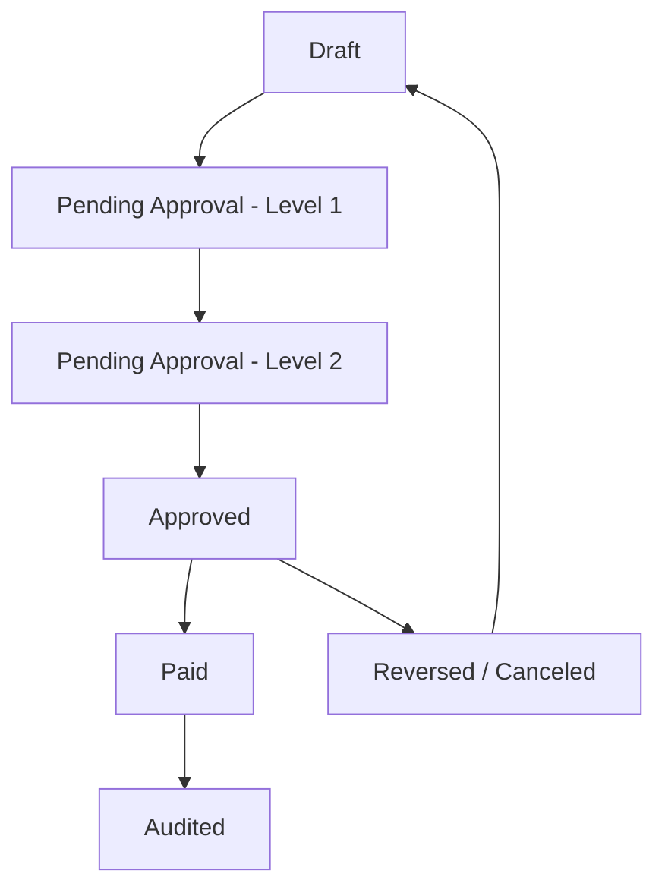
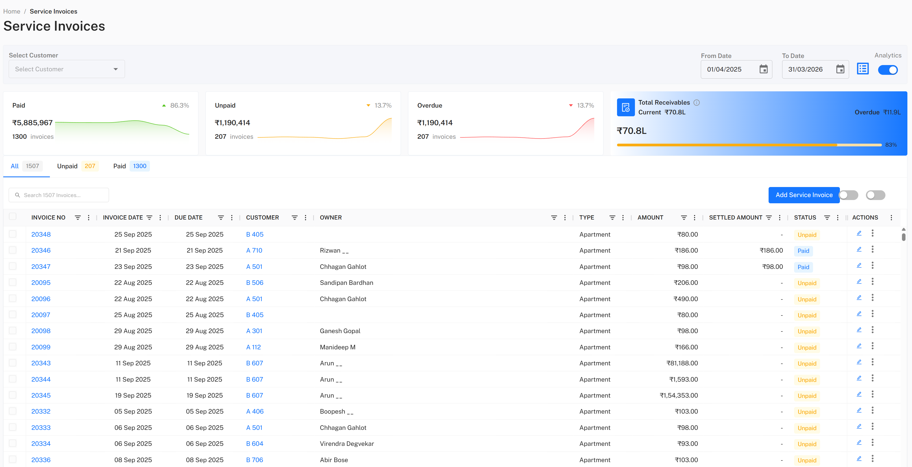
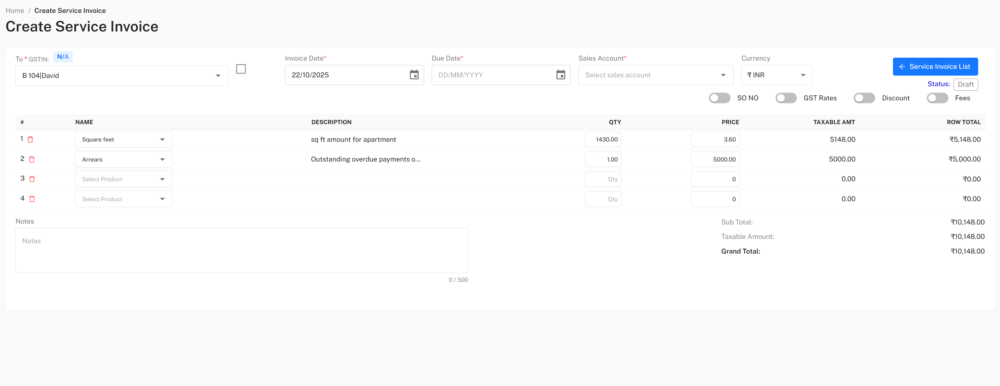
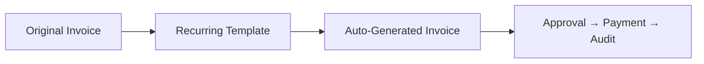

# 🧾 Invoices

Invoices in **Dhanman** make billing intelligent and effortless — designed for real users, not accountants.  
The system automates product, GST, and approval logic, ensuring compliance with minimal manual work.

---

## 📘 Overview

An **Invoice** records the sale of goods or services to a customer.  
Dhanman supports the complete lifecycle — from creation, multi-level approval, and payment, to audit and reversal — all traceable and transparent.

> 💡 **Core Principle:** No invoice is ever deleted — every action is auditable.

---

## 🔁 Invoice Lifecycle

### Stage Definitions

| Stage | Description |
|--------|--------------|
| **Draft** | Created but not yet submitted. Fully editable. |
| **Pending Approval – Level 1** | First approver reviews invoice. |
| **Pending Approval – Level 2** | Second-level approver validation (optional). |
| **Approved** | Finalized and ready for payment. |
| **Paid** | Payment recorded manually or via gateway. |
| **Audited** | Locked after verification; prevents modification. |
| **Reversed / Canceled** | Invoice canceled before audit — returns to Draft state. |

---

## 🧩 Key Highlights

| Feature | Description |
|----------|--------------|
| 🧠 **Customer-specific Products** | Each customer can have pre-linked products or services, automatically prefilled on selection. |
| 💡 **Auto GST Intelligence** | Each product carries its configured GST rate. The system determines **CGST + SGST** or **IGST** automatically based on customer state. |
| 🔁 **Recurring Invoices** | Schedule weekly, monthly, or yearly billing. Ideal for maintenance or rent. |
| 📋 **Copy Existing Invoice** | Duplicate from any previous invoice — all details and taxes included. |
| ⚙️ **Multi-Level Approvals** | Two configurable approval layers (Company or Account level). |
| 📊 **Dashboard Insights** | View invoices by status, overdue count, and financial year performance. |
| 🧾 **Smart Defaults** | Account mappings, tax preferences, and numbering handled automatically. |

---

## 🖥️ Invoice Dashboard

The dashboard offers:

- Filters for **Draft**, **Pending**, **Paid**, **Audited**, and **Reversed**
- Graphs for total billed, collected, and outstanding
- Trends by month or quarter
- Quick actions for **New**, **Copy**, or **Import**

---

## 🧾 Creating a New Invoice

1. Navigate to **Income → Invoices**  
2. Click **➕ New Invoice**  
3. Select a **Customer** → linked products auto-load  
4. Set **Invoice Date**, **Due Date**, and **Payment Terms**  
5. Add or adjust **Items/Services**  
   - GST rates applied per product  
   - System picks **CGST + SGST** (same state) or **IGST** (inter-state)  
6. Add optional **Discounts**, **Shipping**, or **Adjustments**  
7. Add **Notes** or **Terms & Conditions**  
8. Click **Save as Draft** or **Submit for Approval**

> 💡 **Tip:** Copy from an old invoice to reuse customer, items, and taxes.

---

## 🔁 Recurring Invoices

### Setup Steps
1. Choose **Schedule Recurring** from invoice actions  
2. Set **Frequency** (Weekly / Monthly / Quarterly / Yearly)  
3. Define **Start Date** and optional **End Date**  
4. The system generates new invoices automatically using the same items, taxes, and customers

---

## 🧠 Approval Workflow

| Level | Scope | Typical Role |
|--------|--------|--------------|
| Level 1 | Organization | Finance Manager / Admin |
| Level 2 | Account Level | Treasurer / Accountant |

Both approvals are logged permanently for audit trail.

---

## 💸 Payments

Once approved:
- Record manual payments (cash, cheque, transfer)
- Capture gateway payments (e.g., UPI, cards)
- Apply **Advances / Credits**
- Integrate with **Bank Reconciliation**

> Payment confirmation transitions the invoice to **Paid**.  
> Only **Audited** invoices are fully locked.

---

## 🔁 Reversals (Canceling Invoices)

- Use **Reverse Invoice** before audit to cancel incorrect invoices.  
- Invoice becomes **Reversed / Canceled** and reverts to editable **Draft**.  
- No ledger or journal entry is posted until re-approval.

> ⚠️ Once audited, reversal isn’t allowed. Use before locking.

---

## 📦 Importing Invoices

To import existing invoices:

1. Go to **Income → Invoices**  
2. Click **More → Import Invoices**  
3. Upload a `.csv` or `.xlsx` file  
4. Map columns → preview → confirm  
5. The system validates customers and GST automatically

> 💡 A sample format is downloadable from the import page.

---

## 🧭 Quick Actions

| Action | Location | Description |
|---------|-----------|-------------|
| ➕ New Invoice | Dashboard | Create fresh invoice |
| 📋 Copy | ⋮ Menu | Duplicate existing invoice |
| ⏰ Schedule Recurring | ⋮ Menu | Automate periodic invoices |
| 🔁 Reverse | ⋮ Menu | Cancel and return to Draft |
| 📥 Import | More Menu | Bulk upload invoices |

---

## 💡 Best Practices

- Define **customer-product mappings** for repeat clients  
- Let GST auto-apply — avoid manual overrides  
- Review **Pending Approvals** weekly  
- Use **Recurring Invoices** for subscriptions or maintenance  
- Prefer **Reversal** instead of deletion for clean audit logs  

---

## 📚 Related Topics

- [Grouped Invoices](../income/grouped-invoices.md)  
- [Customer Notes](../income/customer-notes.md)  
- [Payments Received](../payments/payments-received.md)  
- [Approval Configuration](../organization/permissions.md)

---

*© B2A Technologies Pvt. Ltd. – Dhanman Product Documentation (2025)*  
*Smart. Simple. Transparent.*
