# 🧭 Dhanman Messaging Design: Acknowledgment Event Pattern

## **Objective**

Enable asynchronous, reliable communication between services using **event-based acknowledgments** instead of blocking request–response.  
Each service that initiates a command will later receive a **targeted acknowledgment event** confirming completion and returning necessary identifiers.

---

## 🧩 **1. Design Philosophy**

- **Fire-and-Forget Commands:** Sales, Purchase, Payroll, and Community send commands to Common or other shared modules.
- **Targeted Acknowledgment Events:** The receiver (e.g., Common) publishes back an acknowledgment event containing IDs or status for the initiating entity.
- **Point-to-Point Routing:** Each acknowledgment event is delivered only to its respective source service, avoiding fanout noise.
- **Guaranteed Delivery:** All acknowledgment events use durable queues bound to a **direct exchange** with explicit routing keys.

---

## 🔁 **2. High-Level Flow Example**

```mermaid
sequenceDiagram
    participant Sales as Dhanman.Sales
    participant Common as Dhanman.Common

    Sales->>Common: 🔶 CreateTransactionCommand (InvoiceId, Amount)
    Common->>CommonDB: 💾 Create Transaction
    Common-->>Sales: 🔵 TransactionPostedForInvoiceEvent (InvoiceId, TransactionId)
    Sales->>SalesDB: 🧾 Update Invoice (TransactionId, Posted = true)
```



---

## 🧱 **3. Exchange and Queue Strategy**

| **Exchange**        | **Type**   | **Publisher** | **Routing Key Pattern** | **Consumer Service** | **Queue Example**                                                  |
| ------------------- | ---------- | ------------- | ----------------------- | -------------------- | ------------------------------------------------------------------ |
| `common.ack.events` | **direct** | Common        | `invoice.posted`        | Sales                | `sales.invoice_posted.queue`                                       |
| `common.ack.events` | **direct** | Common        | `bill.posted`           | Purchase             | `purchase.bill_posted.queue`                                       |
| `common.ack.events` | **direct** | Common        | `salary.posted`         | Payroll              | `payroll.salary_posted.queue`                                      |
| `common.ack.events` | **direct** | Common        | `customer.created`      | Sales / Community    | `sales.customer_created.queue`, `community.customer_created.queue` |
| `common.ack.events` | **direct** | Common        | `vendor.created`        | Purchase             | `purchase.vendor_created.queue`                                    |
| `common.ack.events` | **direct** | Common        | `employee.created`      | Payroll              | `payroll.employee_created.queue`                                   |

---

## 🧩 **4. Complete List of Acknowledgment Events**

| **Origin Service (Sender)** | **Target Publisher (Responder)** | **Command Sent**                         | **Acknowledgment Event**                  | **Payload Fields (Suggested)**                                                    | **Consumer Queue**                    |
| --------------------------- | -------------------------------- | ---------------------------------------- | ----------------------------------------- | --------------------------------------------------------------------------------- | ------------------------------------- |
| **Sales**                   | Common                           | `CreateBasicCustomerCommand`             | `CustomerCreatedForSalesEvent`            | `CustomerId`, `CompanyId`, `OrganizationId`, `CorrelationId`, `CreatedOnUtc`      | `sales.customer_created.queue`        |
|                             | Common                           | `CreateTransactionCommand`               | `TransactionPostedForInvoiceEvent`        | `InvoiceId`, `TransactionId`, `CompanyId`, `OrganizationId`, `PostedOnUtc`        | `sales.invoice_posted.queue`          |
|                             | Common                           | `CreateInvoicePaymentCommand`            | `TransactionPostedForInvoicePaymentEvent` | `InvoicePaymentId`, `TransactionId`, `CompanyId`, `OrganizationId`, `PostedOnUtc` | `sales.invoice_payment_posted.queue`  |
| **Purchase**                | Common                           | `CreateBasicVendorCommand`               | `VendorCreatedForPurchaseEvent`           | `VendorId`, `CompanyId`, `OrganizationId`, `CreatedOnUtc`                         | `purchase.vendor_created.queue`       |
|                             | Common                           | `CreateTransactionCommand`               | `TransactionPostedForBillEvent`           | `BillId`, `TransactionId`, `CompanyId`, `OrganizationId`, `PostedOnUtc`           | `purchase.bill_posted.queue`          |
|                             | Common                           | `CreateBillPaymentCommand`               | `TransactionPostedForBillPaymentEvent`    | `BillPaymentId`, `TransactionId`, `CompanyId`, `OrganizationId`, `PostedOnUtc`    | `purchase.bill_payment_posted.queue`  |
| **Payroll**                 | Common                           | `CreateBasicEmployeeCommand`             | `EmployeeCreatedForPayrollEvent`          | `EmployeeId`, `CompanyId`, `OrganizationId`, `CreatedOnUtc`                       | `payroll.employee_created.queue`      |
|                             | Common                           | `CreateTransactionCommand`               | `TransactionPostedForSalaryEvent`         | `SalaryId`, `TransactionId`, `CompanyId`, `OrganizationId`, `PostedOnUtc`         | `payroll.salary_posted.queue`         |
|                             | Common                           | `CreateSalaryPaymentCommand`             | `TransactionPostedForSalaryPaymentEvent`  | `SalaryPaymentId`, `TransactionId`, `CompanyId`, `OrganizationId`, `PostedOnUtc`  | `payroll.salary_payment_posted.queue` |
| **Community**               | Common                           | `CreateBasicCustomerCommand`             | `CustomerCreatedForCommunityEvent`        | `CustomerId`, `UnitId`, `CompanyId`, `OrganizationId`, `CreatedOnUtc`             | `community.customer_created.queue`    |
| **Common (reverse ack)**    | Community                        | (Triggered when Unit creates a Customer) | `CustomerLinkedToUnitEvent`               | `UnitId`, `CustomerId`, `CompanyId`, `OrganizationId`, `LinkedOnUtc`              | `community.customer_linked.queue`     |

---

## ⚙️ **5. MassTransit Configuration Example**

### **Common.Api Publisher**

```csharp
await _eventPublisher.PublishAsync(new TransactionPostedForInvoiceEvent
{
    InvoiceId = command.InvoiceId,
    TransactionId = transaction.Id,
    CompanyId = command.CompanyId,
    OrganizationId = command.OrganizationId,
    PostedOnUtc = DateTime.UtcNow
}, context =>
{
    context.SetRoutingKey("invoice.posted");
});
```

### **Sales.Api Consumer**

```csharp
cfg.ReceiveEndpoint("sales.invoice_posted.queue", e =>
{
    e.ConfigureConsumeTopology = false;
    e.Bind("common.ack.events", x =>
    {
        x.RoutingKey = "invoice.posted";
    });
    e.ConfigureConsumer<TransactionPostedForInvoiceConsumer>(context);
});
```

---

## 🧠 **6. Why Use Direct Exchange**

✔ Only specific consumers receive relevant messages  
✔ Reduces unnecessary message traffic  
✔ Keeps event routing explicit and predictable  
✔ Easy to extend — just add a new routing key and queue binding for another event type

---

## 🪶 **7. Schema Example (Event DTO)**

```csharp
public record TransactionPostedForInvoiceEvent(
    Guid InvoiceId,
    long TransactionId,
    Guid CompanyId,
    Guid OrganizationId,
    DateTime PostedOnUtc,
    Guid CorrelationId);
```

All acknowledgment events follow a consistent convention:

- Include **CorrelationId** from originating command
- Include **EntityId** (InvoiceId, BillId, etc.)
- Include **TransactionId**
- Include **OrganizationId**, **CompanyId**, and **Timestamp**

---

## 🧩 **8. Summary Checklist**

| ✅ Goal                          | 🧩 Implementation                                                  |
| -------------------------------- | ------------------------------------------------------------------ |
| Maintain async non-blocking flow | Fire commands, listen for acknowledgment events                    |
| Event naming consistency         | Use `TransactionPostedForXEvent`, `CustomerCreatedForXEvent`, etc. |
| Routing isolation                | Use direct exchange with service-specific routing keys             |
| Observability                    | Include CorrelationId in every message                             |
| Reliability                      | Use Outbox pattern for event publishing                            |
| Maintainability                  | Group all acknowledgments under `common.ack.events` exchange       |
