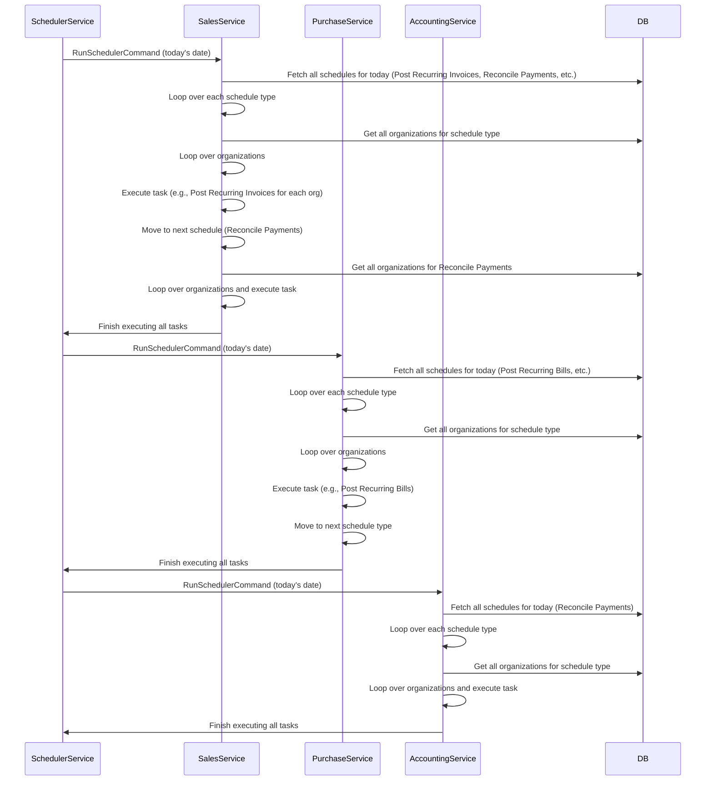

# Architecture Decision Record (ADR)

## Decision ID: 001
**Date:** 2025-10-16  
**Status:** Proposed  
**Context:** Multi-Tenant Scheduling and Task Execution

### Title:  
Sequential Scheduling and Execution for Multi-Tenant Jobs

### Decision

We will implement a **centralized scheduler** that triggers jobs for **multiple tenants** sequentially, ensuring that each job type is processed in isolation to avoid overlapping resource usage and database contention. 

When a scheduler command is triggered, the following flow will occur:

1. **Centralized Command Trigger**: A command (e.g., `RunSchedulerCommand`) will be fired to execute tasks for the specified date (`RunDateUtc`).
2. **Schedule Types**: The service will fetch all **schedule types** (e.g., Post Recurring Invoices, Reconcile Payments, etc.) that need to run for the given date.
3. **Organization Processing**: For each schedule type, the service will loop over all **organizations** that have a scheduled task for that date.
4. **Sequential Execution**: The tasks will be executed sequentially — ensuring that:
    - The first task type (e.g., Sales) is executed.
    - After a predefined delay (e.g., 5 minutes), the next task type (e.g., Purchase) is executed.
    - This continues for each schedule type, preventing database load spikes and ensuring smooth processing.

### Rationale

- **Load Distribution**: By executing tasks sequentially, we avoid overwhelming our shared databases with multiple concurrent heavy queries and updates, ensuring that resource usage is evenly distributed across the day.
  
- **Simpler Coordination**: Staggering job execution reduces the complexity of handling race conditions or conflicts between concurrently executing tasks across multiple services (Sales, Purchase, Accounting).

- **Improved Observability and Control**: Running tasks one after another gives us better tracking and logging for each task, allowing us to handle failures gracefully and retry only specific tasks instead of re-running the entire schedule.

- **Minimal Overhead**: The system will only trigger **one scheduled job per module per day** (Sales, Purchase, Accounting, etc.), reducing the overhead of managing multiple job instances for each organization.

### Consequences

1. **Increased Control Over Execution**: We gain more control over when each task is executed, making it easier to adjust the schedule later if needed.
2. **Simpler Debugging**: Since jobs are staggered, we can focus on troubleshooting specific tasks without worrying about concurrency issues.
3. **Performance Considerations**: The sequential execution model ensures that there is no performance degradation due to simultaneous job execution. However, some scheduling delays (due to the sequential execution model) might be experienced for specific job types.
4. **Future Scalability**: While this design works well for today’s requirements, future optimization could be considered (e.g., dynamic parallelization or partitioning jobs per service) to handle larger workloads.
5. **Job Timeout Handling**: If a job takes too long to process, it could delay subsequent tasks. Timeouts and retries should be considered for ensuring timely completion.

### Alternatives Considered

1. **Simultaneous Execution**  
   - **Pros**: All tasks would execute at the same time, reducing total runtime.  
   - **Cons**: This could overwhelm the database, especially in a multi-tenant system where many organizations are executing heavy jobs simultaneously. This would increase the risk of resource contention, slow queries, and data conflicts.

2. **Single Global Scheduler Job**  
   - **Pros**: One single job triggers everything (e.g., a `RunAllSchedulersCommand`), and the orchestration would be centralized.  
   - **Cons**: It would still have to loop over every schedule and organization in sequence, similar to our chosen solution, and might introduce additional complexity if new schedule types are added in the future.

### Related Decisions
- **Use of Hangfire for Scheduling**: We are using Hangfire for scheduling the periodic jobs (recurring invoices, reconciliation, etc.).
- **MassTransit for Command and Event Handling**: We will publish the `RunSchedulerCommand` to the respective consumers (Sales, Purchase, Accounting) using MassTransit.

### Diagram

### Next Steps

1. **Development**: Implement the `RunSchedulerCommand` with the proper command structure and derived classes for each module (Sales, Purchase, Accounting, etc.).
2. **Testing**: Test with a few different schedule types and ensure the sequential execution and handling of large numbers of organizations works as expected.
3. **Monitoring**: Add proper logging and monitoring around the execution time of each schedule type to ensure that no task takes too long and delays subsequent tasks.

### Decision Made By
- Bharat (System Architect, B2A Technologies Pvt. Ltd.)
