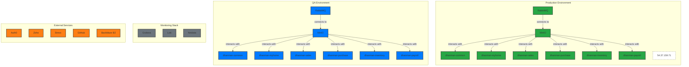

```mermaid
graph TD;
    subgraph Production [Production Environment]
        direction TB
        A[RabbitMQ] -->|connects to| B[MinIO]
        B -->|interacts with| C[dhanman-common]
        B -->|interacts with| D[dhanman-myhome]
        B -->|interacts with| E[dhanman-sales]
        B -->|interacts with| F[dhanman-purchase]
        B -->|interacts with| G[dhanman-inventory]
        B -->|interacts with| H[dhanman-payroll]

        style A fill:#28a745,stroke:#333,stroke-width:2px;
        style B fill:#28a745,stroke:#333,stroke-width:2px;
        style C fill:#28a745,stroke:#333,stroke-width:2px;
        style D fill:#28a745,stroke:#333,stroke-width:2px;
        style E fill:#28a745,stroke:#333,stroke-width:2px;
        style F fill:#28a745,stroke:#333,stroke-width:2px;
        style G fill:#28a745,stroke:#333,stroke-width:2px;
        style H fill:#28a745,stroke:#333,stroke-width:2px;

        IP[51.79.156.217]:::ip
    end

    subgraph QA [QA Environment]
        direction TB
        I[RabbitMQ] -->|connects to| J[MinIO]
        J -->|interacts with| K[dhanman-common]
        J -->|interacts with| L[dhanman-myhome]
        J -->|interacts with| M[dhanman-sales]
        J -->|interacts with| N[dhanman-purchase]
        J -->|interacts with| O[dhanman-inventory]
        J -->|interacts with| P[dhanman-payroll]

        style I fill:#007bff,stroke:#333,stroke-width:2px;
        style J fill:#007bff,stroke:#333,stroke-width:2px;
        style K fill:#007bff,stroke:#333,stroke-width:2px;
        style L fill:#007bff,stroke:#333,stroke-width:2px;
        style M fill:#007bff,stroke:#333,stroke-width:2px;
        style N fill:#007bff,stroke:#333,stroke-width:2px;
        style O fill:#007bff,stroke:#333,stroke-width:2px;
        style P fill:#007bff,stroke:#333,stroke-width:2px;

        IP[54.37.159.71]:::ip
    end

    subgraph Monitoring [Monitoring Stack]
        direction TB
        Q[Grafana]
        R[Loki]
        S[Netdata]

        style Q fill:#6c757d,stroke:#333,stroke-width:2px;
        style R fill:#6c757d,stroke:#333,stroke-width:2px;
        style S fill:#6c757d,stroke:#333,stroke-width:2px;
    end

    subgraph External [External Services]
        direction TB
        T[Auth0]
        U[Zoho]
        V[Brevo]
        W[GitHub]
        X[Backblaze B2]

        style T fill:#fd7e14,stroke:#333,stroke-width:2px;
        style U fill:#fd7e14,stroke:#333,stroke-width:2px;
        style V fill:#fd7e14,stroke:#333,stroke-width:2px;
        style W fill:#fd7e14,stroke:#333,stroke-width:2px;
        style X fill:#fd7e14,stroke:#333,stroke-width:2px;
    end

    classDef ip fill:#fff,stroke:#333,stroke-width:1px,stroke-dasharray: 5 5;
```