# Budgeting System Overview

The budgeting system is designed to enable organizations and their constituent companies to plan, monitor, and analyze their financial resources effectively. It leverages a hierarchical Chart of Accounts maintained at the organization level while supporting granular budget entries and financial tracking at the company level.

## Key Features

- **Company-Level Budgeting:**  
  Budgets are created and managed for individual companies, enabling detailed financial planning aligned with actual business units.

- **Hierarchical Account Structure:**  
  The system uses the organization's Chart of Accounts, supporting multiple levels of accounts. Budget entries are made at the leaf account level, while parent accounts provide aggregated summaries.

- **Flexible Planning Interface:**  
  Users can plan budgets by either entering absolute amounts or specifying percentage changes based on prior period actuals. This flexibility speeds up the budgeting process and enhances usability.

- **Dynamic Roll-ups and Reporting:**  
  Parent account budgets and financial reports are generated by aggregating child account data. The system provides comprehensive variance analysis, showing differences between budgeted and actual amounts in both absolute and percentage terms.

- **Multi-Level Reporting:**  
  Financial reports such as Trial Balance, Balance Sheet, and Budget Variance are available at both company and organization levels, supporting both granular and consolidated views.

This budgeting system integrates with transactional data, ensuring accuracy and consistency in financial management, and supports workflows for drafting, submitting, and approving budgets.



## 1. Proposed Database Tables

```sql
-- Budget header: one per organization + financial year + status etc.
CREATE TABLE public.budgets (
  id uuid DEFAULT gen_random_uuid() PRIMARY KEY,
  organization_id uuid NOT NULL,
  company_id uuid NOT NULL REFERENCES companies(id);
  finance_year_id int4 NOT NULL,
  name text NOT NULL,
  status text NOT NULL DEFAULT 'Draft', -- Draft, Submitted, Approved
  created_by uuid NOT NULL,
  created_on_utc timestamp NOT NULL DEFAULT now(),
  modified_by uuid NULL,
  modified_on_utc timestamp NULL
);

-- Budget line: one per leaf account per period
CREATE TABLE public.budget_lines (
  id uuid DEFAULT gen_random_uuid() PRIMARY KEY,
  budget_id uuid NOT NULL REFERENCES budgets(id) ON DELETE CASCADE,
  account_id uuid NOT NULL REFERENCES chart_of_accounts(id),
  period_start date NOT NULL,
  period_end date NOT NULL,
  amount numeric(15,2) NOT NULL,
  created_on_utc timestamp NOT NULL DEFAULT now(),
  modified_on_utc timestamp NULL
);

-- (Optional) To define account hierarchy levels if not precomputed
CREATE TABLE public.chart_of_account_levels (
  account_id uuid PRIMARY KEY REFERENCES chart_of_accounts(id),
  level int4 NOT NULL -- 1=root, 2=next level, etc.
);
```

## 2. Key Data Handling Logic

- Users enter budgets in `budget_lines` for leaf accounts (e.g., accounts at level 3 or lowest level shown).
- Parent account budgets are *not* entered; they are calculated by summing child leaf budgets when querying or reporting.
- You can filter accounts by `level` in the UI to show only relevant accounts for entry.
- **Budget amount is the source of truth stored in the database.**

## 3. Planning UI Wireframe (Editable % Change or Budget Amount)

```
+----------------------------------------------------------+
| Budget: "FY 2025 Budget"                                  |
| Organization: [Org Name]   Year: [2025]                   |
| Filter: Account Type [Expenses ▼]  Account Level [3 ▼]    |
+----------------------------------------------------------+

| Account Number | Account Name           | Last Year Actual | % Change (editable) | Budget Amount (editable) |
|---------------|------------------------|------------------|---------------------|--------------------------|
| 6001          | Electricity            | 120,000          | [ +5.0%    ]        | [ 126,000 ]              |
| 6002          | Water                  | 80,000           | [ -3.0%    ]        | [ 77,600  ]              |
| 7001          | Cleaning               | 40,000           | [  0.0%    ]        | [ 40,000  ]              |
+----------------------------------------------------------+

[Save Draft]   [Submit for Approval]   [Export Excel]  [Cancel]
```

- Users can **edit either % Change or Budget Amount**, and the other field updates dynamically.
- `Last Year Actual` is fetched dynamically from prior data.
- **Budget amount is saved in DB.**

## 4. Reporting / Variance UI Wireframe

```
+-------------------------------------------------------------+
| Budget vs Actuals Dashboard                                  |
| Organization: [Org Name]   Year: [2025]                      |
| Filter: Account Type [Expenses ▼]  Period: [Monthly ▼]       |
+-------------------------------------------------------------+

| Account Number | Account Name           | Budget | Actual | Variance (Amount) | Variance (%) |
|---------------|------------------------|--------|--------|-------------------|--------------|
| 6000          | Utilities              | 400K   | 420K   | -20K              | -5.0%        |
|   6001        | Electricity            | 150K   | 160K   | -10K              | -6.7%        |
|   6002        | Water                  | 250K   | 260K   | -10K              | -4.0%        |
| 7000          | Maintenance            | 300K   | 280K   | +20K              | +7.1%        |
|   7001        | Cleaning               | 120K   | 130K   | -10K              | -8.3%        |
|   7002        | Repairs                | 180K   | 150K   | +30K              | +20.0%       |
+-------------------------------------------------------------+

[Export PDF]   [Drilldown Details]   [Filter Options]
```

- Variance is shown both as an absolute amount and percentage for clear analysis.

## 5. Data Aggregation for Parent Accounts

- Parent accounts budgets and actuals are **calculated by summing child leaf accounts**.
- Leaf accounts are where budget amounts are entered.

---

## Summary

| Aspect           | Details                                             |
|------------------|-----------------------------------------------------|
| Budget Entries   | Only on leaf accounts (lowest visible level)         |
| Parent Budgets   | Calculated by summing all child leaf accounts’ budgets |
| Filtering        | By account level and account type                      |
| UI              | Editable % Change or Budget Amount in planning; read-only budget in reporting |
| Reporting       | Shows budget, actual, variance (amount and %) at all hierarchy levels |

---

## 1. Fetch Budget Lines for a Company & Financial Year

```sql
SELECT
  bl.id,
  bl.account_id,
  coa.account_number,
  coa.name AS account_name,
  bl.period_start,
  bl.period_end,
  bl.amount AS budget_amount
FROM public.budget_lines bl
JOIN public.budgets b ON bl.budget_id = b.id
JOIN public.chart_of_accounts coa ON bl.account_id = coa.id
WHERE b.company_id = :company_id
  AND b.finance_year_id = :finance_year_id
ORDER BY coa.account_number, bl.period_start;
```

## 2. Get Last Year Actuals per Account for a Company & Period

```sql
SELECT
  je.account_id,
  SUM(je.amount) AS actual_amount
FROM public.journal_entries je
JOIN public.transaction_headers th ON je.transaction_id = th.id
WHERE th.company_id = :company_id
  AND je.transaction_date BETWEEN :period_start AND :period_end
GROUP BY je.account_id;
```

## 3. Aggregate Budget and Actuals for Company by Account

```sql
WITH budget_data AS (
  SELECT
    bl.account_id,
    SUM(bl.amount) AS total_budget
  FROM public.budget_lines bl
  JOIN public.budgets b ON bl.budget_id = b.id
  WHERE b.company_id = :company_id
    AND b.finance_year_id = :finance_year_id
  GROUP BY bl.account_id
),
actual_data AS (
  SELECT
    je.account_id,
    SUM(je.amount) AS total_actual
  FROM public.journal_entries je
  JOIN public.transaction_headers th ON je.transaction_id = th.id
  WHERE th.company_id = :company_id
    AND je.transaction_date BETWEEN :period_start AND :period_end
  GROUP BY je.account_id
)

SELECT
  coa.account_number,
  coa.name,
  bd.total_budget,
  ad.total_actual,
  (bd.total_budget - COALESCE(ad.total_actual, 0)) AS variance_amount,
  CASE WHEN bd.total_budget = 0 THEN NULL
       ELSE ROUND(((bd.total_budget - COALESCE(ad.total_actual, 0)) / bd.total_budget) * 100, 2)
  END AS variance_percentage
FROM budget_data bd
LEFT JOIN actual_data ad ON bd.account_id = ad.account_id
JOIN public.chart_of_accounts coa ON bd.account_id = coa.id
ORDER BY coa.account_number;

```

## 4. Consolidated Budget and Actuals Across All Companies in an Organization
```sql
WITH budget_data AS (
  SELECT
    bl.account_id,
    SUM(bl.amount) AS total_budget
  FROM public.budget_lines bl
  JOIN public.budgets b ON bl.budget_id = b.id
  JOIN public.companies c ON b.company_id = c.id
  WHERE c.organization_id = :organization_id
    AND b.finance_year_id = :finance_year_id
  GROUP BY bl.account_id
),
actual_data AS (
  SELECT
    je.account_id,
    SUM(je.amount) AS total_actual
  FROM public.journal_entries je
  JOIN public.transaction_headers th ON je.transaction_id = th.id
  JOIN public.companies c ON th.company_id = c.id
  WHERE c.organization_id = :organization_id
    AND je.transaction_date BETWEEN :period_start AND :period_end
  GROUP BY je.account_id
)

SELECT
  coa.account_number,
  coa.name,
  bd.total_budget,
  ad.total_actual,
  (bd.total_budget - COALESCE(ad.total_actual, 0)) AS variance_amount,
  CASE WHEN bd.total_budget = 0 THEN NULL
       ELSE ROUND(((bd.total_budget - COALESCE(ad.total_actual, 0)) / bd.total_budget) * 100, 2)
  END AS variance_percentage
FROM budget_data bd
LEFT JOIN actual_data ad ON bd.account_id = ad.account_id
JOIN public.chart_of_accounts coa ON bd.account_id = coa.id
ORDER BY coa.account_number;

```

## 5. Roll-Up Budget Summary at Parent Account Level (Recursive Query Example)
```sql
WITH RECURSIVE coa_tree AS (
  SELECT
    id,
    parent_account_id,
    account_number,
    name
  FROM public.chart_of_accounts
  WHERE parent_account_id IS NULL -- root level accounts

  UNION ALL

  SELECT
    c.id,
    c.parent_account_id,
    c.account_number,
    c.name
  FROM public.chart_of_accounts c
  INNER JOIN coa_tree ct ON c.parent_account_id = ct.id
),
budget_sums AS (
  SELECT
    bl.account_id,
    SUM(bl.amount) AS total_budget
  FROM public.budget_lines bl
  JOIN public.budgets b ON bl.budget_id = b.id
  WHERE b.company_id = :company_id
    AND b.finance_year_id = :finance_year_id
  GROUP BY bl.account_id
)
SELECT
  ct.id AS account_id,
  ct.account_number,
  ct.name,
  COALESCE(SUM(bs.total_budget), 0) AS budget_amount
FROM coa_tree ct
LEFT JOIN budget_sums bs ON bs.account_id = ct.id
GROUP BY ct.id, ct.account_number, ct.name
ORDER BY ct.account_number;

```


