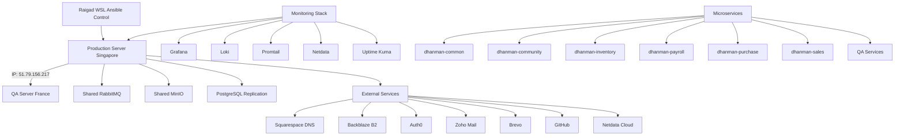

```mermaid
graph TD;
    A[Production Server Singapore] -->|IP: 51.79.156.217| B[QA Server France];
    A --> C[Shared RabbitMQ];
    A --> D[Shared MinIO];
    A --> E[PostgreSQL Replication];
    A --> F[External Services];
    F --> G[Squarespace DNS];
    F --> H[Backblaze B2];
    F --> I[Auth0];
    F --> J[Zoho Mail];
    F --> K[Brevo];
    F --> L[GitHub];
    F --> M[Netdata Cloud];
    N[Raigad WSL Ansible Control] --> A;
    O[Monitoring Stack] --> A;
    O --> P[Grafana];
    O --> Q[Loki];
    O --> R[Promtail];
    O --> S[Netdata];
    O --> T[Uptime Kuma];
    U[Microservices] --> V[dhanman-common];
    U --> W[dhanman-community];
    U --> X[dhanman-inventory];
    U --> Y[dhanman-payroll];
    U --> Z[dhanman-purchase];
    U --> AA[dhanman-sales];
    U --> AB[QA Services];
```